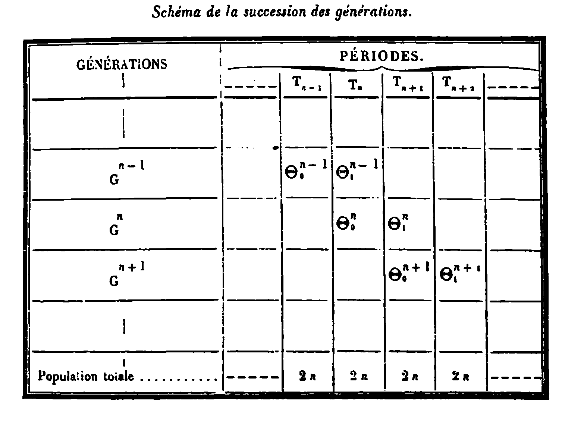

# Macroeconomic-Theory
A 12 classes introductory course in Macroeconomics


This course presents macroeconomic modeling at an intermediate level. We will cover three core models that are the basis for many more advanced and complex models used in the field. A strong grasp of the benchmark models is a necessary preliminary step both to go to more advanced topics and maybe more importantly to fully understand the basic economic channels that are almost always present even in more complex models. The course also presents the mathematical methods that are used both to specify and to solve the benchmark models. These methods are interesting by themselves as they can be applied to many other questions and fields.

Below you find links to Jupyter Notebooks that contain the slides and the material of the course. You also find links to web based presentation of the class.Beware that sometimes notebook do not render in Github. In that case you need to download it and open it with jupyter locally.

> The pursuit of a widely accepted analytical macroeconomic core, in which to locate discussions and extensions, may be a pipe dream, but it is a dream surely worth pursuing. 
>
> Olivier Blanchard - 2018

### The state of Macro

Teaching an intermediate macroeconomic course has become challenging after the 2008 Great Financial Crisis. The crisis challenged the mainstream New Keynesian Dynamic Stochastic General Equilibrium (DSGE) model, which fell short in its performance during this financial downturn. This underscored the necessity for extensive improvements and enhancements in the model, leading to significant advancements such as the introduction of a sophisticated financial sector, agent heterogeneity, and economic networks. Additionally, it sparked a discourse on the need for revolutionary approaches in macroeconomics. This notion was once again reinforced during the 2019-2022 pandemic, as the mainstream macroeconomic model faced another unexpected test. The crisis stimulated two fundamental responses: one advocating for the augmentation of the existing model and another championing fresh methodologies. However, both factions acknowledge the indispensable need for a standard set of initial tools, referred to as 'the core' by mainstream economists and a set of 'toy models' by reformist thinkers.

This course presents the theoretical framework of three key components within the core models, alternatively referred to as toy models: the neoclassical growth model, the overlapping generation model, and the new Keynesian model. The models, while not designed for policy application or forecasting, provide valuable insights into essential economic transmission channels and serve as a foundation for understanding methodologies that can be utilized in more complex and realistic models.

These models are well established and have been refined in their presentation by many decades of research showcasing the cumulative knowledge nature of macroeconomics. The cumulative knowledge attribute emphasizes that many assumptions and pieces of these models originate from previous studies and are taken as primitive in their current exposition. This cumulative process is valuable and necessary for constructing the analytical core. However, it's worth noting that in sharp contrast to the natural sciences, these assumptions and their implications cannot be empirically validated within a laboratory setting. This necessitates a heightened awareness, equipping us with the ability to adapt or modify them as empirical evidence dictates.

#### Methods
Macroeconomics is inherently dynamic; therefore, the required mathematical methods for analyzing macro models involve dynamic systems.  Methods are instruments and must not determine the specification of models; it is, therefore, essential to be acquainted with many methods that permit handling different models. For example, sometimes a model is more naturally cast in continuous time, sometimes in discrete time. This course presents dynamic optimization solutions using *optimal control* techniques for continuous time models and *mathematical programming* for discrete-time models. Similarly, the solution analysis requires solving a *system of differential equations* in the first case and a *system of difference equations* in the second. Finally, the new Keynesian model introduces some *elementary methods for stochastic models*.  Unlike a numerical macroeconomics course where models are processed on a computer, all computations here are done analytically. A brief description of the three models is provided in what follows. 

---
**Box I:  Microfounding economic decision in Macroeconomics**
In the models we analyse, the dynamic optimization problem derives from the microeconomic behavior of agents who perform optimal choices by maximizing a utility function that has few relevant arguments, such as consumption (in the three models), and leisure (only in the last model). The agents consider the complete time horizon of their remaining life and their budget constraints. In the basic framework they are forward-looking and know everything about the economy and the future (this is called perfect foresight in deterministic environments).  The solution of this dynamic optimization results in differential/difference system of equations that describe the behaviour of the relevant variables of the model.

<p align="center">
  
</p>

---

### Model I - The Neoclassical Growth Model

The British mathematician Frank Ramsey introduced the model that bare his name in 1928, a model that sought to answer the key question: "how much should a nation save from its income?”. In his analysis, Ramsey made several simplifying assumptions such as no population growth, time additive separable stationary utility of consumption and disutility of labor, absence of a discount rate, no heterogeneity, and a closed economy. His findings led to the formulation of a simple rule[^fn0]. 

In the 1960s, Ramsey's model was rediscovered by economists exploring the notion of an optimal rate of economic growth. One significant study during this time was the 1963 paper by Tjalling Koopmans. His work, filled with insightful references, is well worth reading as it epitomizes the process of cumulative knowledge advancement in economic theory. 

David Cass further developed this model in 1965, introducing the optimal control methodology applied to solve the same model. The methodology and notation introduced by Cass are still extensively used in modern economic textbooks today[^fn1], underscoring its enduring relevance and impact in the field.

[^fn0]: "The rate of saving multiplied by the marginal utility of money should always be equal to the amount by which the total net rate of enjoyment of utility falls short of the maximum possible rate of enjoyment." 
[^fn1]: The only substantial difference between Cass presentation and modern text books presentation is the choice of the variables used in the phase diagram. Cass uses the price of capital and capital, while modern textbooks use consumption and capital.  

The modern rendering of Ramsey's model can be summarized as follows. The social planner problem maximizes a  time-separable stream of felicity functions over the infinite horizon subject to a resource constraint and initial conditions. In mathematical terms, he solves the following problem

$$
\max_{c(t),k(t)}\ U(0)=\int_{0}^{\infty}e^{-\rho t}u(c(t))dt
$$

s.t.	

$$
f(k(t))	=c(t)+\dot{k}(t)+nk(t)
$$

$$
k_{0}>0,\ \ c(t)>0,\ \ k(t)\geq0
$$

In this problem, $\rho$ is the discount rate and $n$ the growth rate of the population, $u(c(t))$ is the instantaneous felicity function that depends on consumption $c$, $f(k(t))$ is production achieved with technology $f$ that uses $k$ capital (per capita), and $\dot{k}(t)$ is the change in time of the capital stock due to investment. The course presents a general methodology to solve the above problem and characterize qualitatively the solution through a phase diagram.

<p align="center">
  
</p>

The resolution of this laboratory model permits to present several important results. First, how economic aggregate dynamics are determined by decisions at the microeconomic level. Second to clarify the intuition and the conditions under which there is an equivalence between the optimum solution achieved by the Social planner and the competitive equilibrium achieved by markets. Third the economic channels through which interest rates affect savings. Fourth, the effect on capital accumulation of the choice between tax and debt financing.  Fifth nominal variables are decoupled from real variables. Sixth it permits the analysis of the effects of different types of "shocks". Importantly, it identifies the hypothesis behind these six results.

### Model 2 - OLG

The second model presented is the overlapping generation model. Maurice Allais first presented the model in an appendix of "Economie e Intérêt" (1947), but maybe because the book was in French, it remained relatively unknown for years.  In 1958, Paul Samuelson wrote what, for a long time, was thought to be the first overlapping generation model in what became a classic paper. Samuelson showed that an economy with overlapping generations could sustain a positive interest rate, even without productive capital or growth. In 1965 Peter Diamond, used the overlapping generation model developed by Samuelson to explore the relationship between the level of national debt and economic growth within a neoclassical framework. The notation of Diamond is essentially what we find in modern textbooks. The OLG model is important because it departs from some assumptions of the Ramsey model. For example, in the OLG, agents have a finite life and differ in age and social function. In the basic formulation, there are generations yet unborn whose preferences may not be registered in current market transactions. These departures have important implications that overturn some results of the Ramsey model, such as the equivalence of the optimum and the competitive equilibrium or the indifference between tax and debt financing on capital accumulation. 

The basic demographic structure of the model is well explained by the original table in Allais appendix.

<p align="center">
  
</p>

This structure makes it clear that discrete time is better suited. A period represents the span of a generation, and generations overlap. Consider the case of generations that live in two time periods, $1$, and $2$ and the competitive equilibrium setup in a decentralized economy where we analyze each sector (households, non-financial sector, and government) separately. The problem of a household during his first period of life is

$$
\max\ u(c_{1t})+(1+\rho)^{-1}u(c_{2t+1})
$$

subject to budget constraints, where $c_{1t}$ is consumption when young is indexed by $1$ and $c_{2t}$ is consumption when old is indexed by $2$. Of course, with more generations, you could have more indexes and the problem becomes quickly intractable analytically. In the non financial sector firms maximize profits:

$$
\max\ F\left(K_{t},N_{t}\right)-w_{t}N_{t}-r_{t}K_{t}
$$

Where $F$ is technology, $w$ is the real wage that goes to labor $N$, $r$ is the real interest rate equal to the rental rate of capital, $K$.  The goods market equilibrium implies that investment equals saving

$$
K_{t+1}-K_{t}=N_{t}s(w_{t},r_{t+1})-K_{t}.
$$

$N_t$ denotes the total population and equals employment. As mentioned before, the resolution of the overlapping generation permits finding cases in which the competitive equilibrium might not be Pareto optimal (over-accumulation of capital). It also allows studying life-cycle behavior and social security arrangements such as the pay-as-you-go or fully funded pension systems. Like the Ramsey model, the basic OLG is a real model where monetary phenomena are decoupled and have no effects on the allocations.

### Model 3 - NKM
The third model we cover is known as the 'New Keynesian model', which takes its foundational roots from the General Theory by John Maynard Keynes (1936), with a major focus on the effects of Monetary policy in Knut Wicksell's theory of the natural rate of interest.  Its current iteration is a product of continuous cumulative scholarship that has progressively embedded the concepts of Keynes and Wickell within the Ramsey model, or less frequently, the Overlapping Generation model. This allows for an in-depth exploration of subjects such as aggregate demand fluctuation, monetary policy, and unemployment. The version employed in this course enhances a discrete-time edition of a simplified Ramsey model with several new components. Firstly, it introduces the concept of imperfect competition as proposed by Stiglitz and Dixit, illustrated by the monopolistic competition "trick" via the following consumption aggregator:

$$
C=\left[\int_{0}^{1}C(i)^{\left(\eta-1\right)/\eta}di\right]^{\eta/(\eta-1)},\eta>1
$$

Second, it includes the concept of nominal rigidities (contributed by Keynes, Fisher, Taylor, Calvo, and Rothemberg), emphasizing that prices are not capable of instantaneous adjustment. Third, it incorporates stochastic shocks such as technology, government, and interest rate shocks, which are precursors to economic fluctuations. The New Keynesian model is fully grounded in microeconomic principles, like the Ramsey and the OLG models. Once solved, it can be encapsulated by two equilibrium equations and one policy rule, which form a dynamic, modern representation of the traditional static IS-LM:

```math
\begin{aligned}
\widetilde{y}_{t} =E_{t}\widetilde{y}_{t+1}-\sigma\left[i_{t}-E_{t}\left\{ \pi_{t+1}\right\} \right]+u_{t}^{IS} \\
\pi_{t} =\beta E_{t}\pi_{t+1}+\lambda\widetilde{y}_{t}+u_{t}^{PC} \\
i_{t} =MR(\pi_{t},\widetilde{y}_{t},...)+u_{t}^{MP}
\end{aligned}
```
					
In the above equations $\tilde{y}$ represents the output gap, signifying the notion of under-utilized resources, while $\pi$ denotes inflation, establishing the importance of nominal aspects, and $i$ is the nominal interest rate set by the central bank. The $u$’s represent different kinds of demand, supply, and monetary policy shocks.

## Course Classes

Starred references are required.

## Class 1 Introduction to the course 


[Introduction notebook](https://github.com/hyperfra/Macroeconomic-Theory/blob/main/Classes/Class1.ipynb)

[Introduction html](https://hyperfra.github.io/MacroTheoryClass1/)

## Class 2-4 Infinite-Horizon

[Slides 2 notebook](https://github.com/hyperfra/Macroeconomic-Theory/blob/main/Classes/Class2.ipynb)

[Slides 2 html](https://hyperfra.github.io/MacroTheoryClass2/)

[Slides 3 notebook](https://github.com/hyperfra/Macroeconomic-Theory/blob/main/Classes/Class3.ipynb)

[Slides 3 html](https://hyperfra.github.io/MacroTheoryClass3/)

[Slides 4 notebook](https://github.com/hyperfra/Macroeconomic-Theory/blob/main/Classes/Class4.ipynb)

[Slides 4 html](https://hyperfra.github.io/MacroTheoryClass4/)


In the first class we lay down the framework for the course's map and present the Ramsey-Cass-Koopman model. We build on the Solow Model and endogenise the consumption-saving decision. The resulting model is known as the Ramsey-Cass-Koopman models.


### Learning curve

- Micro-foundations of saving-consumption behavior
- The concept of welfare
- The steady state and the dynamics (phase diagram)
- Comparative statics on parameters
- Government expenditure in the model

### Methods
The solve the model we need to learn how optimal control. The solution of the model consists in a system of differential equations.


### Readings

- Chapter II Advanced Macroeconomics, D. Romer
- [Cass, David. “Optimum Growth in an Aggregative Model of Capital Accumulation.” The Review of Economic Studies 32, no. 3 (1965): 233–40.](https://doi.org/10.2307/2295827)
- [Koopmans Tjalling, “On the Concept of Optimal Economic Growth”. In The Economic Approach to Economic Planning. Amsterdam: Elsevier.](https://elischolar.library.yale.edu/cgi/viewcontent.cgi?article=1391&context=cowles-discussion-paper-series)
- [Ramsey Frank, “A Mathematical Theory of Saving”. Economic Journal 38 (December 1928): 543-559.](https://www.jstor.org/stable/2224098)
- * Blanchard Olivier Jean and Stanley Fischer, Lectures in Macroeconomics, 1989 chapter 2.


## Class 5-7 Overlapping Generations Models

The overlapping generation model introduced by Samuelson and Diamond. The perpetual Youth model of Blanchard.

[Slides 5 notebook](https://github.com/hyperfra/Macroeconomic-Theory/blob/main/Classes/Class5.ipynb)

[Slides 5 html](https://hyperfra.github.io/MacroTheoryClass5/)

[Slides 6 notebook](https://github.com/hyperfra/Macroeconomic-Theory/blob/main/Classes/Class6.ipynb)

[Slides 6 html](https://hyperfra.github.io/MacroTheoryClass6/)

[Slides 7 notebook](https://github.com/hyperfra/Macroeconomic-Theory/blob/main/Classes/Class7.ipynb)

[Slides 7 html](https://hyperfra.github.io/MacroTheoryClass7/)

### Learning Curve
- Identify the difference between infinite horizon and OLG
- Steady state and dynamics
- Dynamic inefficiency
- Government expenditure in the model
- Social Security
### Methods
We introduce discrete time difference equations.

### Readings 2
- Chapter II Advanced Macroeconomics, D. Romer
- [Diamond, Peter A. “National Debt in a Neoclassical Growth Model.” The American Economic Review 55, no. 5 (1965): 1126–50.](http://www.jstor.org/stable/1809231.)
- * Blanchard Olivier Jean and Stanley Fischer, Lectures in Macroeconomics, 1989 chapter 3.
- [Blanchard, Olivier J. “Debt, Deficits, and Finite Horizons.” Journal of Political Economy 93, no. 2 (1985): 223–47.](http://www.jstor.org/stable/1832175.)


## Class 8-12

The New Keynesian Model

[Slides 8 notebook](https://github.com/hyperfra/Macroeconomic-Theory/blob/main/Classes/class8.ipynb)

[Slides 8 html](https://hyperfra.github.io/MacroTheoryClass8/)

[Slides 9 notebook](https://github.com/hyperfra/Macroeconomic-Theory/blob/main/Classes/class9.ipynb)

[Slides 9 html](https://hyperfra.github.io/MacroTheoryClass9/)

[Slides 10 notebook](https://github.com/hyperfra/Macroeconomic-Theory/blob/main/Classes/class10.ipynb)

[Slides 10 html](https://hyperfra.github.io/MacroTheoryClass10/)

[Slides 11 html](https://hyperfra.github.io/MacroTheoryClass11/)

[NKM dynare code](https://github.com/hyperfra/Macroeconomic-Theory/blob/main/Classes/NKM2.mod)

The optimal problem. Intertemporal choice, shocks, uncertainty. The first order conditions. Solving the model. Log-linearization. Special cases and other short cuts. Nominal rigidites, imperfect competition, demand determined output. Introduction to NKM. Monetary Policy in the NKM.

### Learning Curve
- The classical model with endogenous labor supply
- The stochastic shocks and the implied dynamics
- Imperfect competition
- Price rigidities

### Methods
First order approximations, system of stochastic linear difference equations

### Readings 3
- Romer. Chapter V and Chapter VI.
- * Jordi Gali Monetary Policy, Inflation, and the Business Cycle: An Introduction to the New Keynesian Framework. Chap 2 and 3.
